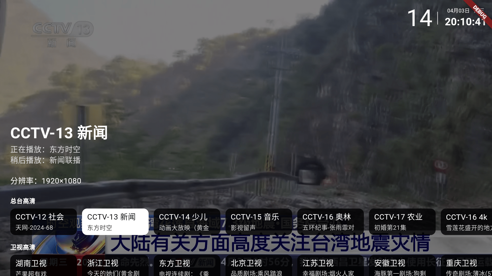

<div align="center">
    <h1>我的电视</h1>
<div align="center">
    
</div>
    <p>使用Flutter开发的电视直播软件</p>
    

<br/>

</div>

## 使用

遥控器操作方式主流电视直播软件一致；

频道切换：使用上下方向键，或者数字键切换频道；屏幕上下滑动；

频道选择：OK键；单击屏幕；

设置页面：菜单、帮助键；双击屏幕；

## 下载

可以通过右侧release进行下载或拉取代码到本地进行编译

## 说明

- 仅支持Android5及以上，其他端未测试
- 4K频道可能会出现卡顿
- 网络环境必须支持IPV6
- 只在自家电视上测过，其他电视稳定性未知
- 为了减少安装包大小，仅支持`armeabi-v7a`、`arm64-v8a`架构，`x86_64`自行编译


## 功能

目前着重移动端(Android)、电视端(Android)，暂时没有适配桌面端、Pad端等

- [x] 换台反转
- [x] 数字选台
- [x] 节目单（正在播放）
- [x] 开机自启
- [ ] 应用更新
- [x] 平滑换台（换台时无黑屏）
- [ ] 自定义直播源
- [ ] 性能优化

## 开发环境

```
[√] Flutter (Channel stable, 3.19.4, on Microsoft Windows [版本 10.0.19045.3448], locale zh-CN)
[√] Windows Version (Installed version of Windows is version 10 or higher)
[√] Android toolchain - develop for Android devices (Android SDK version 34.0.0)
[√] Visual Studio - develop Windows apps (Visual Studio 生成工具 2022 17.7.5)
[√] Android Studio (version 2023.2)
[√] VS Code, 64-bit edition (version 1.87.2)
```

## 声明

此项目（我的电视）是个人为了兴趣而开发, 仅用于学习和测试。 所用API皆从官方网站收集, 不提供任何破解内容。

## 致谢

- [my-tv](https://github.com/lizongying/my-tv)
- [参考设计稿](https://github.com/lizongying/my-tv/issues/594)
- [IPV6直播源](https://github.com/zhumeng11/IPTV)
- [pilipala](https://github.com/guozhigq/pilipala)
- 等等
